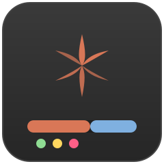
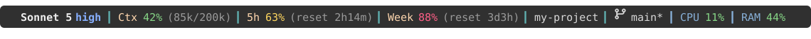
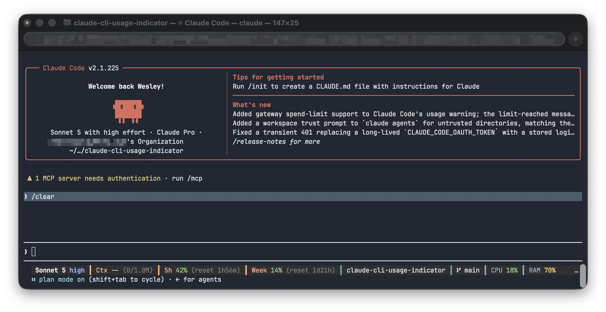

<p align="center">
  
</p>

<h1 align="center">claude-cli-usage-indicator</h1>

A configurable status line for [Claude Code](https://claude.com/claude-code) that shows, in a colored band under your prompt:

- **Model** in use, bold, with the current **reasoning effort** (`low`/`medium`/`high`/`xhigh`/`max`) glued next to it, color-coded
- **Context window** usage: percentage plus token count for the current session
- **5-hour** and **weekly** rate-limit usage, with time-to-reset shown as a relative countdown, an exact clock time, or both
- **Git branch** (with a `*` if the working tree is dirty) and current folder
- **CPU** and **RAM** usage of your machine

Plus two optional **detail panels** you can expand under the band with a single command, without interrupting whatever Claude is doing: a color-coded breakdown of what's filling your context window, and a session summary (model, effort, permission mode, cost, lines changed). See [detail panels](#detail-panels).

Claude-usage indicators and machine-usage indicators are tinted in two distinct colors so you can tell them apart at a glance. Everything, from which indicators show, to their order, to every color and threshold, is controlled by a plain-text config file. The band auto-wraps onto more than one row if your terminal is too narrow to fit everything.

All data comes from the JSON payload Claude Code's `statusLine` feature pipes to the script on every render: on session start/resume, on Claude Code's own update events, and (optionally) on a timer you configure (see [refresh interval](#configure-how-often-indicators-refresh)), so values stay fresh without you having to prompt Claude just to force a re-render. No undocumented APIs, no extra auth.

One caveat that's on Claude Code's side, not this script's: `context_window` and `rate_limits` are only included in that payload once you've sent your first message of the session. A brand-new session shows `Ctx --`, `5h --`, `Week --` until then, no matter how low you set the refresh interval. There's currently no supported way to make Claude Code populate them earlier.

Works on **Linux** and **macOS**.

## Example

<p align="center">
  
</p>

<p align="center"><sub>shown with the optional Nerd Font branch icon. The default install uses 🌿, see <a href="#configure-the-branch-icon">below</a>.</sub></p>

<p align="center">
  
</p>

## Requirements

- `bash`
- [`jq`](https://jqlang.org/): `brew install jq` (macOS) or `apt install jq` / `dnf install jq` / `pacman -S jq` (Linux)
- `git`: needed to clone this repo, and to power the `branch` indicator once installed

Nothing else. The branch indicator uses an emoji (🌿) by default, so it works out of the box in any terminal, no extra fonts required.

## Install

```bash
git clone https://github.com/galvaowesley/claude-cli-usage-indicator.git
cd claude-cli-usage-indicator
./install.sh
```

This copies `statusline.sh` to `~/.claude/statusline.sh` and points Claude Code's `statusLine` setting at it (in `~/.claude/settings.json`), without touching anything else already in that file. Re-running it is safe.

Partway through, the installer asks a few questions, each with an illustrated example of what you're picking:

- which icon to use for the git branch indicator: the default emoji, or a sharper Nerd Font icon (only pick this if your terminal is already using a Nerd Font, see [below](#configure-the-branch-icon));
- how to show the 5-hour/weekly reset time: a relative countdown (`reset 3h45m`), the exact clock time (`reset 14:32`), or both, plus a 24h/12h clock style (see [below](#configure-the-reset-time-display));
- how often indicators should auto-refresh on their own: off by default, or every few seconds so reset countdowns and usage % feel live even while you're idle (see [below](#configure-how-often-indicators-refresh));
- whether to install the small companion hook that lets the session panel show your permission mode (see [detail panels](#detail-panels)).

You can always change any of these answers later by editing the config file (or, for the refresh rate, `settings.json`) directly. Nothing here is one-shot.

Restart Claude Code, or open a new session, to see the status line.

## Configure

The first render auto-creates `~/.claude/statusline.conf` with every indicator enabled. Open it and edit freely; comments in the file document each option:

```
# one indicator name per line, in display order
model
effort
context
five_hour
week
dir
branch
cpu
ram

# visual style
bg=236
sep_char=┃
sep_color=73
color_low=114
color_mid=221
color_high=203
threshold_mid=50
threshold_high=80
claude_color=216
system_color=110
model_color=255
effort_low=178
effort_medium=114
effort_high=111
effort_xhigh=141
effort_max=203
branch_icon=🌿
reset_format=relative
reset_clock=24h
panel_border=240
panel_label=245
cat_input=214
cat_cache_read=75
cat_cache_write=114
cat_output=141
cat_free=240
```

- **Remove a line** to hide that indicator; **reorder lines** to change display order.
- Colors are [256-color codes](https://www.ditig.com/256-colors-cheat-sheet).
- Changes apply on the next render, no restart needed.

### Configure the branch icon

The installer already asks you to pick one, but here's how to check or change it any time.

**1. Open the config file:**

```bash
open ~/.claude/statusline.conf        # macOS
xdg-open ~/.claude/statusline.conf    # Linux (or just open it in your editor)
```

**2. Find (or add) the `branch_icon=` line** and set it to one of:

- `branch_icon=🌿`: the default. Works in every terminal, no setup needed.
- `branch_icon=`: a sharper code-branch icon. Requires a Nerd Font (see below); without one it shows as `?` or a blank box.

Save the file. It applies on the next status line render, no restart needed.

**3. If you want the sharper icon, install and select a Nerd Font first:**

Many dev terminal setups already have one, for example if you use prompt themes like Powerlevel10k or Starship. If yours doesn't yet:

**On macOS:**

```bash
brew install --cask font-jetbrains-mono-nerd-font
```

Then select it as your terminal's font:
1. Open Terminal (or iTerm2) and go to **Settings**.
2. Go to **Profiles → Text → Font → Change...**.
3. Pick **"JetBrainsMono Nerd Font"** from the list.
4. Close and reopen the terminal app (a new tab isn't enough).

**On Linux:**

```bash
mkdir -p ~/.local/share/fonts
curl -fLo ~/.local/share/fonts/JetBrainsMonoNerdFont-Regular.ttf \
  https://github.com/ryanoasis/nerd-fonts/raw/master/patched-fonts/JetBrainsMono/Ligatures/Regular/JetBrainsMonoNerdFontMono-Regular.ttf
fc-cache -fv
```

Then set it as your terminal emulator's font (the exact menu varies; in GNOME Terminal it's **Preferences → Profile → Text → Custom font**). Close and reopen the terminal app afterward.

Installing the font alone isn't enough in either case: the terminal app only uses it once you select it in its own settings.

### Configure the reset time display

`five_hour` and `week` show when your rate limit resets. Choose how by setting `reset_format` in `~/.claude/statusline.conf`:

| `reset_format=` | Looks like | Notes |
| --- | --- | --- |
| `relative` (default) | `reset 3h45m` | a countdown; also `1d2h` once it's more than a day out |
| `absolute` | `reset 14:32` | the exact local clock time; prefixed with the weekday (`Mon 14:32`) if the reset isn't today |
| `both` | `reset 14:32 (3h45m)` | exact time plus the countdown |

For `absolute`/`both`, `reset_clock` picks 24h (`14:32`, default) or 12h (`2:32pm`) style.

The installer asks for both up front; to change them later just edit those two lines and save, and it applies on the next render.

### Configure how often indicators refresh

By default the status line only re-renders on Claude Code's own events (session start/resume, a new assistant message, `/compact`, permission-mode changes, vim-mode toggles). That's enough for most indicators, but anything time-based, like the reset countdown or usage % changing while you're idle, can go stale between those events.

Claude Code's `statusLine.refreshInterval` setting (1–60 seconds) fixes that by re-running the script on a timer too. The installer asks for a value (off by default; 5s is a good balance) and writes it straight into `~/.claude/settings.json`:

```json
{
  "statusLine": {
    "type": "command",
    "command": "~/.claude/statusline.sh",
    "padding": 0,
    "refreshInterval": 5
  }
}
```

To change it later, edit `refreshInterval` in `settings.json` directly (or remove it to go back to event-only updates), or just re-run `./install.sh` and answer differently.

A lower interval means more indicator freshness but also more forked processes per minute. The `cpu`/`ram` indicators are the heaviest (each shells out to `top`/`vm_stat` or reads `/proc`), so if you enabled those, avoid going below ~3s.

`refreshInterval` needs a Claude Code version that supports it; on an older version it's simply ignored and the status line falls back to event-only updates, no error.

This only controls *how often* the script re-runs. It can't make `context_window`/`rate_limits` show up before your first message of the session, since Claude Code itself doesn't send that data until then (see the caveat near the top of this README).

## Detail panels

The band is one line by design. When you want more, `ccx` expands a panel of extra rows underneath it. Toggling a panel is a local file write, so it never interrupts Claude, costs no tokens, and works fine mid-generation.

```bash
ccx            # toggle the context panel
ccx session    # toggle the session panel
ccx off        # collapse
ccx status     # print the current state
```

Inside Claude Code, run it with the `!` prefix: `!ccx`. If the installer didn't link `ccx` onto your PATH, use the full path (`!~/.claude/ccx`) or add `alias ccx='~/.claude/ccx'` to your shell rc.

The panel appears on the status line's next render. With `refreshInterval` unset, that means the next time Claude Code updates the status line anyway; if you want it to feel immediate, set a [refresh interval](#configure-how-often-indicators-refresh).

### The context panel

```
 ╭─ Context ─────────────────────────────────────────────────────────╮
 │ claude-opus-5 · 1.0M window                      38.5k / 1.0M  4% │
 │ ████░░░░░░░░░░░░░░░░░░░░░░░░░░░░░░░░░░░░░░░░░░░░░░░░░░░░░░░░░░░░░ │
 │   █ Fresh input                                     8.5k     0.9% │
 │   █ Cache read                                     25.0k     2.5% │
 │   █ Cache write                                     5.0k     0.5% │
 │   █ Output                                          1.2k     0.1% │
 │     Free space                                    960.3k    96.0% │
 ╰───────────────────────────────────────────────────────────────────╯
```

Each category has its own color, shared between its swatch and its slice of the stacked bar, so the bar is readable without a legend.

**One thing to be clear about:** these are not the categories `/context` shows. Claude Code's status line payload exposes token counts split by *cache behavior*, not by content type. There is no way for any status line script to see the system prompt / tools / memory / skills / messages breakdown that `/context` renders, so this panel reports the split that is actually available rather than approximating one that isn't. Use `/context` when you want the content-type view.

Before your first message of the session, and briefly after `/compact`, Claude Code sends no breakdown at all, and the panel says so instead of showing zeroes.

### The session panel

```
 ╭─ Session ─────────────────────────────────────────────────────────╮
 │ Model    claude-opus-5     Effort   xhigh        Mode     plan    │
 │ Thinking on                Fast     off          Cost     $1.24   │
 │ Time     42m               Lines    +318/-97                      │
 │ ───────────────────────────────────────────────────────────────── │
 │ switch   Meta+P model + effort   Shift+Tab mode   Meta+T think    │
 ╰───────────────────────────────────────────────────────────────────╯
```

This panel reports state and lists the keys that change it. It is not a picker, and that is a platform limit rather than a shortcut taken here: nothing a script, hook, or settings file can do will change a running session's model, effort, or permission mode. The keys in the last row do it directly, and they already work mid-generation, which is what you actually want. `Meta` is Option on macOS and Alt elsewhere.

**Permission mode needs the companion hook.** Claude Code sends `permission_mode` to hooks but not to status lines, so without the hook the panel shows `--`. The installer offers to add it; it writes one word to one file, prints nothing, and always exits 0. Because it runs on tool use, the value can trail a `Shift+Tab` by a moment, and a value older than five minutes is marked with a trailing `~`.

### Panel notes

- **The state is global, not per session.** Toggling in one window expands the panel in every open session on its next render. The toggling process has no way to learn a session id, so scoping it per session isn't possible.
- **Panels need at least 60 columns.** Below that the box would wrap and shred the layout, so the status line says so instead of drawing it. Between 60 and about 78 columns the session panel drops to two columns.
- Colors are configurable through the `panel_*` and `cat_*` keys shown in [Configure](#configure).

## Uninstall

```bash
./uninstall.sh            # removes the script + statusLine setting, keeps your config
./uninstall.sh --purge    # also deletes statusline.conf and the CPU-usage cache
```

This also removes `ccx`, the permission-mode hook script, and the hook's entry in `settings.json`. Only entries pointing at this project's own script are touched; hooks belonging to anything else are left exactly as they were.

## Changelog

See [CHANGELOG.md](CHANGELOG.md) for what's changed. To update an existing install, `git pull` and re-run `./install.sh`.

## Why not a Claude Code plugin / marketplace listing?

Claude Code plugins can add commands, agents, hooks, and MCP servers, but the `statusLine` setting is a top-level key in `settings.json` that isn't currently exposed to plugins, so a marketplace plugin can't set it on install. A small installer script is the standard way status lines like this one are distributed today; that's what `install.sh` does here.

## Star History

[](https://app.repohistory.com/star-history)

## Credits

Inspired by a status-line idea shared by Rodrigo Belém on LinkedIn.

## License

MIT, see [LICENSE](LICENSE).
